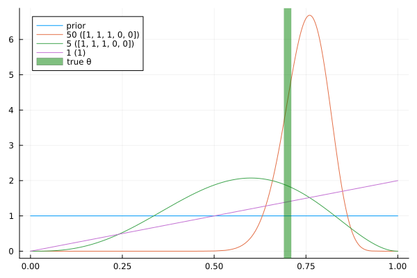
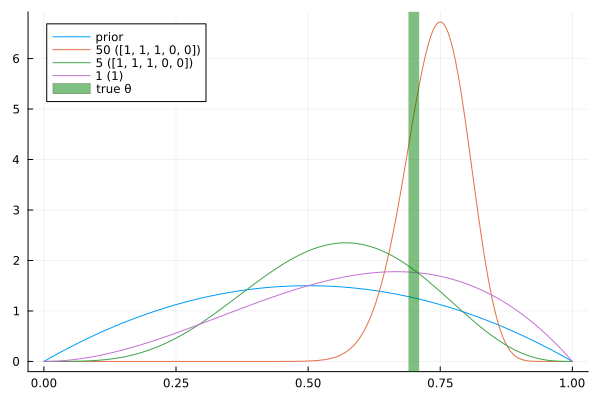

# team09

## Part 4

### c)

Je mehr Samples man zieht, desto mehr nähert sich die Verteilung des Posteriors dem tatsächlichen `p` an.

### d)

Der neue Prior ist nun keine Gleichverteilung mehr, sondern ähnelt der tatsächlichen Verteilung schon etwas mehr. Der Unterschied lässt sich gut an dem Posterior nach einem Experiment sehen (lila Kurve). Wo oben nur eine schiefe Linie zu sehen ist, ist der Posterior bei einem informierten Prior schon nach einem Experiment dem tatsächlichen Wert viel näher. Nach 5 oder auch 50 Experimenten ist der Unterschied aber nicht mehr auszumachen.

### e)

Wenn ein Uniform Prior gewahlt wird, ist der MLE gleich dem MAP.

Wenn n gegen unendlich geht, geht der Unterschied zwischen MLE und MAP gegen 0.

Wenn $\alpha$ größer wird, desto mehr nähert sich der MAP 1 an, egal was $n$ und $x$ sind. Wenn $\beta$ größer wird, geht der MAP gegen 0. Das ergibt auch Sinn, da $\alpha$ die Verteilung nach links und $\beta$ die Verteilung nach rechts verschiebt. Der MAP verschiebt das geschätzte $p$ also etwas in eine der beiden Richtungen.

Der MAP bezieht den Prior noch ein, der MLE hingegen ist uniformiert.

