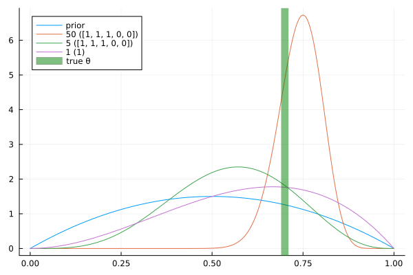

# team09

## Part 4

### c)

Je mehr Samples man zieht, desto mehr nähert sich die Verteilung des Posteriors dem tatsächlichen `p` an.

### d)

Der neue Prior ist nun keine Gleichverteilung mehr, sondern ähenlt der tatsächlichen Verteilung nun schon etwas mehr. Der Unterschied lässt sich gut an dem Posterior nach einem Experiment sehen (lila Kurve). Wo oben nur eine schiefe Linie zu sehen ist, ist der Posterior bei einem informierten Prior schon nach einem Experiment dem tatsächlichen Wert viel näher. Nach 5 oder auch 50 Experimenten ist der Unterschied aber nicht mehr auszumachen.

### e)

