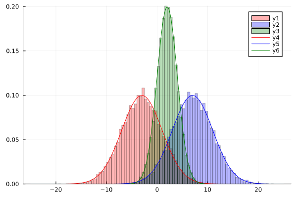
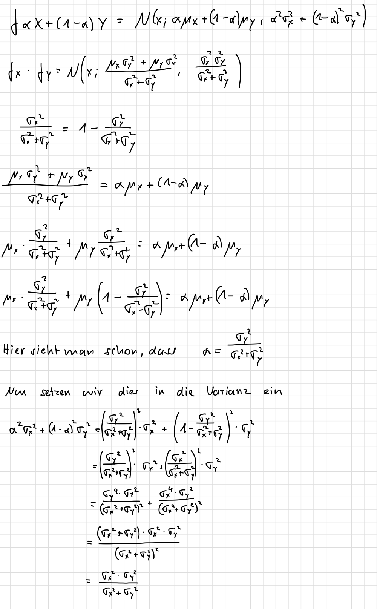
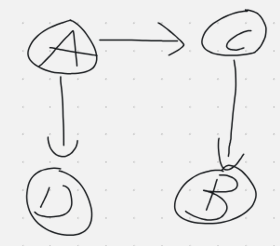
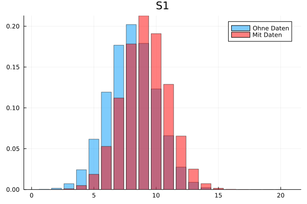
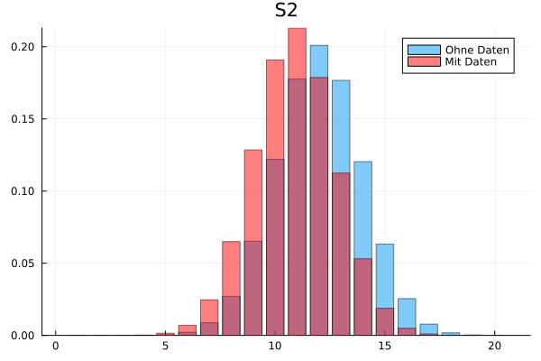
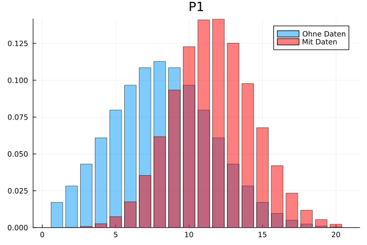
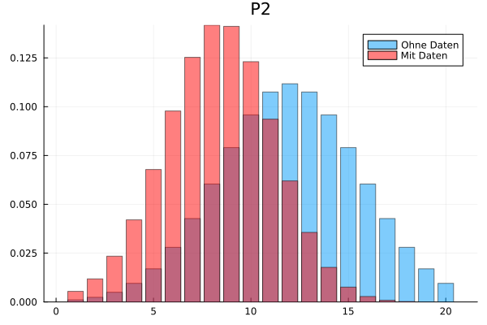
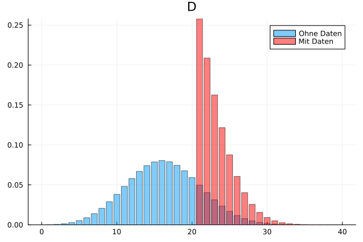

## Aufgabe 1
### a)


### b)



## Aufgabe 2

ci = conditionally independent

### a)
- D und E sind ci
  - D, B, E: tail-to-tail, da B clamped
  - D, H, E: head-to-head, H und alle Nachfolger von H nicht clamped
- A und E sind ci
  - gleiche Gründe wie bei D und E
- A und C sind ci
  - auch wieder gleiche Gründe

### b)
- D und E sind nicht ci
  - der Pfad D, B, E hat keinen blockierenden Knoten
- A und E sind nicht ci ?
  - ?
- E und F sind ci
  - da C clamped ist, hat der einzige Pfad E, C, F einen blockierenden Knoten (tail-to-tail)

### c)
- A und G nicht ci
  - Der einzige Pfad A, D, G hat keinen blockiereneden Knoten
- C und I sind ci
  - ?? 
- A und I sind ci
  - Auf Pfad A, D, H, I gibt es einen head-to-head Knoten (H) der blockierend ist, der er clamped ist
  - Auf dem Pfad A, D, B, E, H, I auch einen head-to-head über B, E, H, I da E und H clamped sind

### d)
- A und H sind nicht ci
  - Auf dem Pfad A, D, B, E, H gibt es keinen blockierenden Knoten
- C und I sind nicht ci
  - ?? ist E ein blockierender Knoten?
- G und F sind ci
  - Auf dem Pfad G, D, H, E, C, F ist D blockierender Knoten da er clamped und tail-to-tail ist
  - Auf dem Pfad G, D, E, E, C, F sind E ein blockierender Knoten, da E head-to-head Knoten aber nicht clamped ist, so wie seine Nachkommen.

### e)


## Aufgabe 3
 





Hier die Ausgabe:
```
All Marginals *with* data by summing out:
s1:  P = [0.0, 0.0001, 0.001, 0.0049, 0.0186, 0.0528, 0.1121, 0.1783, 0.2128, 0.1909, 0.1288, 0.0655, 0.0251, 0.0072, 0.0016, 0.0003, 0.0, 0.0, 0.0, 0.0]
s2:  P = [0.0, 0.0, 0.0, 0.0002, 0.0015, 0.007, 0.0247, 0.065, 0.1285, 0.1909, 0.2131, 0.1787, 0.1125, 0.0531, 0.0188, 0.005, 0.001, 0.0001, 0.0, 0.0])
p1:  P = [0.0, 0.0002, 0.0008, 0.0027, 0.0074, 0.0175, 0.0354, 0.0617, 0.0934, 0.1228, 0.1409, 0.1416, 0.1252, 0.0977, 0.0678, 0.042, 0.0234, 0.0118, 0.0054, 0.0023]
p2:  P = [0.0054, 0.0118, 0.0234, 0.042, 0.0678, 0.0978, 0.1253, 0.1418, 0.1411, 0.123, 0.0936, 0.062, 0.0356, 0.0177, 0.0076, 0.0028, 0.0009, 0.0002, 0.0, 0.0]
d:  P = [0.0, 0.0, 0.0, 0.0, 0.0, 0.0, 0.0, 0.0, 0.0, 0.0, 0.0, 0.0, 0.0, 0.0, 0.0, 0.0, 0.0, 0.0, 0.0, 0.0, 0.258, 0.2088, 0.1625, 0.1217, 0.0876, 0.0606, 0.0403, 0.0257, 0.0156, 0.0091, 0.0051, 0.0027, 0.0013, 0.0006, 0.0003, 0.0001, 0.0, 0.0, 0.0]

------------------------------------------------------------


All Marginals *with* data with Sum-Product:
S1:  P = [0.0, 0.0001, 0.001, 0.0049, 0.0186, 0.0528, 0.1121, 0.1783, 0.2128, 0.1909, 0.1288, 0.0655, 0.0251, 0.0072, 0.0016, 0.0003, 0.0, 0.0, 0.0, 0.0]
S2:  P = [0.0, 0.0, 0.0, 0.0002, 0.0015, 0.007, 0.0247, 0.065, 0.1285, 0.1909, 0.2131, 0.1787, 0.1125, 0.0531, 0.0188, 0.005, 0.001, 0.0001, 0.0, 0.0]
P1:  P = [0.0, 0.0002, 0.0008, 0.0027, 0.0074, 0.0175, 0.0354, 0.0617, 0.0934, 0.1228, 0.1409, 0.1416, 0.1252, 0.0977, 0.0678, 0.042, 0.0234, 0.0118, 0.0054, 0.0023]
P2:  P = [0.0054, 0.0118, 0.0234, 0.042, 0.0678, 0.0978, 0.1253, 0.1418, 0.1411, 0.123, 0.0936, 0.062, 0.0356, 0.0177, 0.0076, 0.0028, 0.0009, 0.0002, 0.0, 0.0]
D:  P = [0.0, 0.0, 0.0, 0.0, 0.0, 0.0, 0.0, 0.0, 0.0, 0.0, 0.0, 0.0, 0.0, 0.0, 0.0, 0.0, 0.0, 0.0, 0.0, 0.0, 0.258, 0.2088, 0.1625, 0.1217, 0.0876, 0.0606, 0.0403, 0.0257, 0.0156, 0.0091, 0.0051, 0.0027, 0.0013, 0.0006, 0.0003, 0.0001, 0.0, 0.0, 0.0]
------------------------------------------------------------
Zeiten:
Summing Out: 50.13258910179138 s
Sum Product: 0.32404494285583496 s
Verhältnis: 154.70875323641442 s
```

Das Model funktioniert auch für andere Verteilungen der Faktoren. 